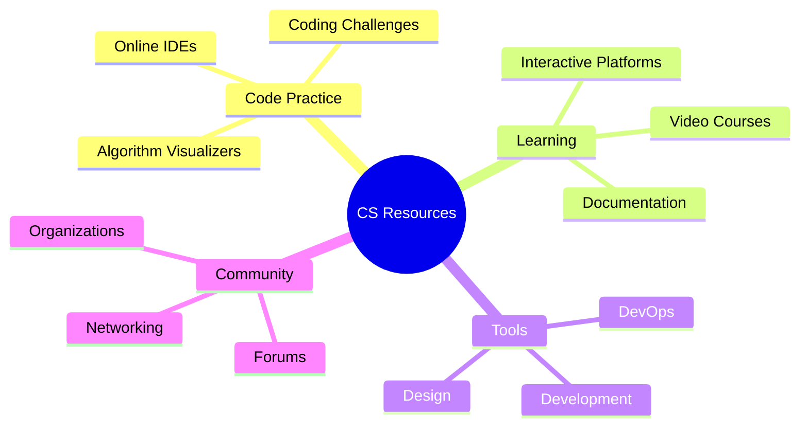
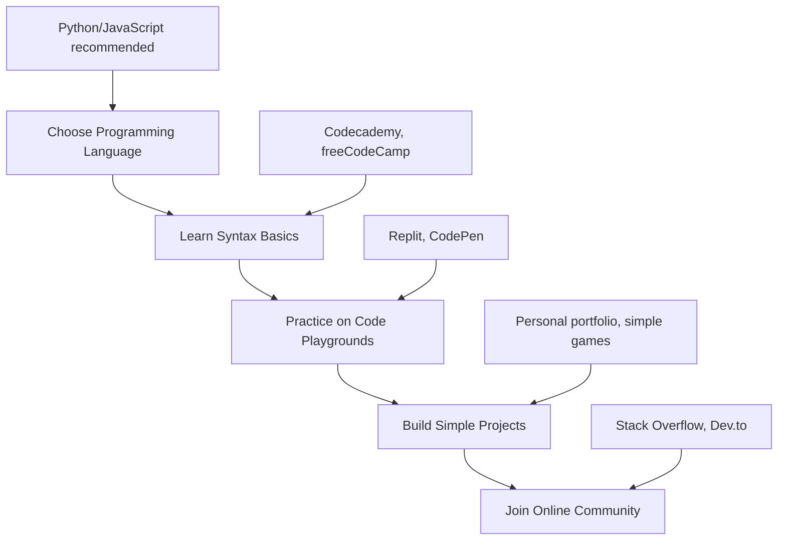
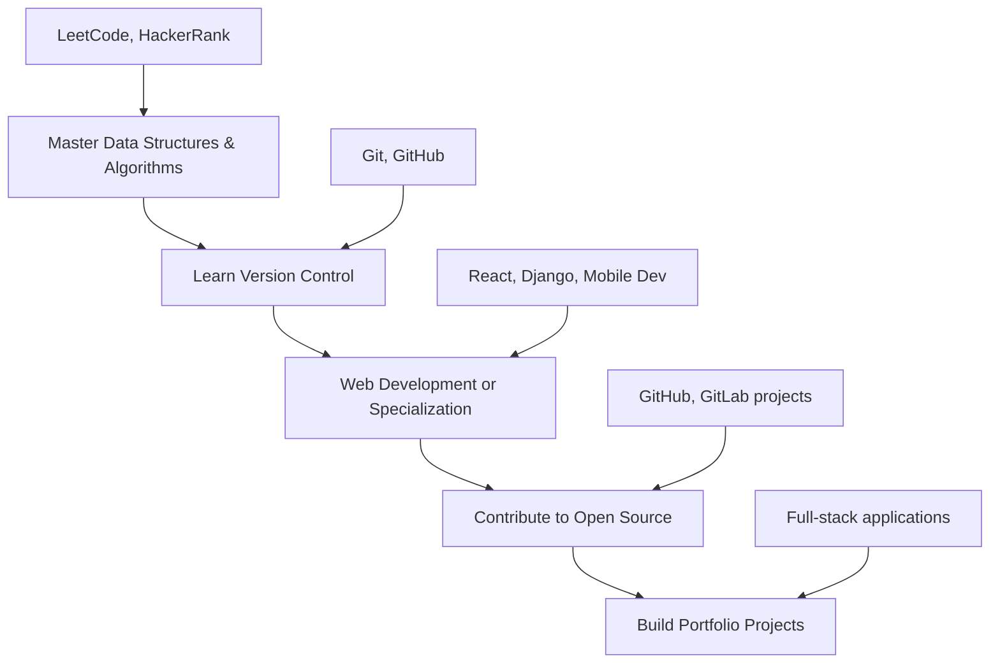
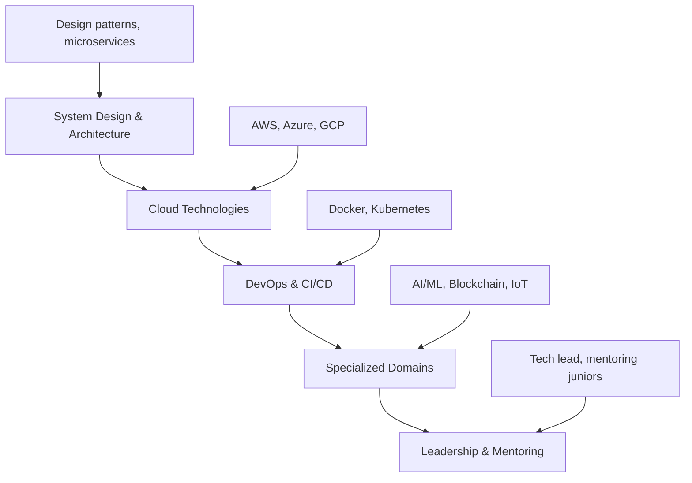

# 🎓 Comprehensive Computer Science Learning Resources Guide

## 📋 Table of Contents

- [🎯 Overview](#overview)
- [🛠️ Code Playgrounds & Online IDEs](#code-playgrounds--online-ides)
- [🔍 Algorithm & Data Structure Visualizers](#algorithm--data-structure-visualizers)
- [🎮 Interactive Learning Platforms](#interactive-learning-platforms)
- [📚 Educational Resources & Online Courses](#educational-resources--online-courses)
- [🤖 AI/ML Learning Platforms](#aiml-learning-platforms)
- [📊 Data Science & Analytics Tools](#data-science--analytics-tools)
- [📈 Data Visualization Tools](#data-visualization-tools)
- [🔄 Version Control & DevOps Tools](#version-control--devops-tools)
- [🎨 Design & Multimedia Tools](#design--multimedia-tools)
- [🔗 Programming Languages Resources](#programming-languages-resources)
- [🌐 Web Development Tools](#web-development-tools)
- [📱 Mobile Development Platforms](#mobile-development-platforms)
- [⚡ Database Management Systems](#database-management-systems)
- [🎯 Specialized CS Tools](#specialized-cs-tools)
- [👥 Community & Networking](#community--networking)
- [🏆 Diversity & Inclusion Organizations](#diversity--inclusion-organizations)

---

## 🎯 Overview

This comprehensive guide provides over **500+ curated resources** for computer science students, developers, and technology enthusiasts. The resources are organized into logical categories for easy navigation and discovery.

### 🚀 Quick Start Categories

---

## 🛠️ Code Playgrounds & Online IDEs

### Multi-Language IDEs
- **[Replit](https://replit.com/)** - Multi-language online IDE with collaborative features
- **[CodeSandbox](https://codesandbox.io/)** - Cloud development environments for web apps
- **[Gitpod](https://www.gitpod.io/)** - Complete development environment in the cloud
- **[StackBlitz](https://stackblitz.com/)** - Online VS Code-powered IDE for web development
- **[Glitch](https://glitch.com/)** - Collaborative platform for building web apps with a creative community

### JavaScript/Web Development
- **[CodePen](https://codepen.io/)** - Front-end development playground and social community
- **[JSFiddle](https://jsfiddle.net/)** - JavaScript, CSS, HTML playground with live preview
- **[PlayCode](https://playcode.io/)** - JavaScript playground and sandbox environment
- **[p5.js Web Editor](https://editor.p5js.org/)** - Web editor for creative coding with p5.js library

### Language-Specific Playgrounds
- **[Go Playground](https://go.dev/play/)** - Official Go programming language playground
- **[TypeScript Playground](https://www.typescriptlang.org/play/)** - TypeScript/JavaScript editor with IntelliSense
- **[Java Playground](https://dev.java/playground/)** - Java language exploration and testing tool
- **[Python Fiddle](https://python-fiddle.com/)** - Online Python playground with code sharing
- **[TryRuby](https://try.ruby-lang.org/)** - Interactive Ruby learning environment

### Specialized IDEs
- **[JDoodle](https://www.jdoodle.com/)** - Support for 88+ programming languages
- **[OneCompiler](https://onecompiler.com/)** - Feature-rich online compiler for various languages
- **[OnlineGDB](https://www.onlinegdb.com/)** - Online compiler and debugger with multi-language support
- **[Codiva](https://www.codiva.io/)** - Real-time compilation IDE for C, C++, and Java

---

## 🔍 Algorithm & Data Structure Visualizers

### Comprehensive Algorithm Visualizers
- **[VisuAlgo](https://visualgo.net/)** - 24 visualization modules for algorithms and data structures
- **[Algorithm Visualizer](https://algorithm-visualizer.org/)** - Interactive code-based algorithm visualization
- **[Python Tutor](https://pythontutor.com/visualize.html)** - Code visualization for multiple languages
- **[CS 1332 Visualizations](https://csvistool.com/)** - Official Georgia Tech CS visualization tool

### Specialized Visualizers
- **[Sorting Visualizer](https://sortvisualizer.com/)** - Interactive visualization of 15+ sorting algorithms
- **[Pathfinding Visualizer](https://pathfinding-visualizer-rho.vercel.app/)** - Dijkstra's, A*, BFS pathfinding algorithms
- **[Binary Tree Visualizer](https://binarytreevisualizer.net/)** - BST, AVL, and Red-Black tree operations
- **[Graph Online](https://graphonline.top/en/)** - Create graphs and find shortest paths, MSTs

### Educational Algorithm Collections
- **[OpenDSA](https://opendsa-server.cs.vt.edu/)** - Interactive textbooks and visualizations
- **[Data Structure Visualizations (USF)](https://www.cs.usfca.edu/galles/visualization/Algorithms.html)** - University of San Francisco CS visualizations
- **[Y. Daniel Liang's Animations](https://yongdanielliang.github.io/animation/animation.html)** - Algorithm animations for textbooks

### Interactive Learning Tools
- **[Labuladong Algo Visualizer](https://labuladong.online/algo/en/intro/visualize/)** - Data structures and algorithms visualization
- **[Hello Interview](https://www.hellointerview.com/learn/code)** - Interactive coding interview preparation
- **[Log2Base2](https://log2base2.com/courses/data-structure)** - Visual programming and algorithms learning

---

## 🎮 Interactive Learning Platforms

### Game-Based Learning
- **[CodeCombat](https://codecombat.com/)** - Learn programming through fantasy RPG gameplay
- **[CodinGame](https://www.codingame.com/)** - Programming puzzles and contests with game elements
- **[CheckiO](https://checkio.org/)** - Python and JavaScript coding games with challenges
- **[Codédx](https://www.codedx.io/)** - Gamified platform for learning Python, HTML, CSS, JavaScript

### Interactive Coding Practice
- **[LeetCode](https://leetcode.com/)** - Technical interview preparation with online judge
- **[HackerRank](https://www.hackerrank.com/)** - Coding challenges and skill assessments
- **[Coderbyte](https://www.coderbyte.com/)** - Programming challenges for interview preparation
- **[Exercism](https://exercism.org/)** - Code practice with mentor feedback in 50+ languages

### Beginner-Friendly Platforms
- **[Code.org](https://code.org/)** - K-12 computer science curriculum and activities
- **[Scratch](https://scratch.mit.edu/)** - Visual programming language for creative projects
- **[Blockly](https://developers.google.com/blockly/)** - Visual programming editor library
- **[App Lab](https://code.org/educate/applab)** - JavaScript app development environment

### Specialized Learning
- **[Brilliant](https://brilliant.org/)** - Interactive STEM learning with problem-solving approach
- **[Boot.dev](https://www.boot.dev/)** - Gamified backend web development learning
- **[ProjectLearn](https://projectlearn.io/)** - Project-based learning across various tech domains
- **[CodeCrafters](https://app.codecrafters.io/)** - Build real-world projects to learn software development

---

## 📚 Educational Resources & Online Courses

### University Courses & MOOCs
- **[MIT OpenCourseWare](https://ocw.mit.edu/courses/electrical-engineering-and-computer-science/)** - Free MIT course materials and lectures
- **[Stanford Online](https://online.stanford.edu/courses/computer-science)** - Stanford's computer science courses online
- **[Harvard CS50](https://cs50.harvard.edu/x/2024/)** - Introduction to computer science and programming
- **[University of the People](https://www.uopeople.edu/programs/cs/)** - Tuition-free accredited CS degree program

### Major MOOC Platforms
- **[Coursera](https://www.coursera.org/browse/computer-science)** - University courses and specializations from top institutions
- **[edX](https://www.edx.org/learn/computer-science)** - Online courses from universities worldwide
- **[Udemy](https://www.udemy.com/courses/development/programming-languages/)** - Marketplace for programming and development courses
- **[FutureLearn](https://www.futurelearn.com/subjects/it-and-computer-science-courses)** - Online courses from leading universities

### Free Learning Platforms
- **[Khan Academy](https://www.khanacademy.org/computing/computer-science)** - Free courses in programming and CS fundamentals
- **[freeCodeCamp](https://www.freecodecamp.org/)** - Interactive web development curriculum with certifications
- **[The Odin Project](https://www.theodinproject.com/)** - Full-stack web development curriculum
- **[Full Stack Open](https://fullstackopen.com/en/)** - Modern web development course by University of Helsinki

### Skill-Based Platforms
- **[Codecademy](https://www.codecademy.com/)** - Interactive programming lessons and projects
- **[SoloLearn](https://www.sololearn.com/)** - Mobile-friendly programming courses with community
- **[GA Dash](https://dash.generalassemb.ly/)** - Web development basics through browser projects
- **[Upskill](https://upskillcourses.com/)** - Free web development bootcamp essentials

### Specialized Learning Resources
- **[Teach Yourself CS](https://teachyourselfcs.com/)** - Self-directed computer science education guide
- **[CS Unplugged](https://www.csunplugged.org/)** - Teaching CS concepts without computers
- **[Isaac Computer Science](https://isaaccomputerscience.org/)** - GCSE and A-level CS platform
- **[Ada Computer Science](https://adacomputerscience.org/)** - Free online CS program

---

## 🤖 AI/ML Learning Platforms

### Major AI/ML Frameworks
- **[TensorFlow](https://www.tensorflow.org/)** - Open-source machine learning platform by Google
- **[PyTorch](https://pytorch.org/)** - Deep learning framework with dynamic computation graphs
- **[Keras](https://keras.io/)** - High-level neural networks API for TensorFlow
- **[Scikit-learn](https://scikit-learn.org/stable/)** - Machine learning library for Python

### Research Organizations & Resources
- **[Google AI](https://ai.google/)** - AI research, tools, and educational resources
- **[OpenAI](https://openai.com/)** - AI research and deployment company
- **[DeepMind](https://deepmind.com/)** - AI research laboratory (Google subsidiary)
- **[Allen Institute for AI](https://allenai.org/)** - Non-profit AI research institute

### Educational AI Platforms
- **[Fast.ai](https://www.fast.ai/)** - Practical deep learning courses and research
- **[Coursera AI Courses](https://www.coursera.org/browse/data-science/machine-learning)** - ML specializations from top universities
- **[edX AI Courses](https://www.edx.org/learn/artificial-intelligence)** - AI and ML courses from universities

### Specialized ML Tools
- **[Hugging Face](https://huggingface.co/)** - Natural language processing models and datasets
- **[Kaggle](https://www.kaggle.com/)** - Data science competitions and learning platform
- **[Papers With Code](https://paperswithcode.com/)** - ML research papers with code implementations

---

## 📊 Data Science & Analytics Tools

### Jupyter Notebook Platforms
- **[Jupyter](https://jupyter.org/)** - Open-source interactive computing environment
- **[Google Colab](https://colab.research.google.com/)** - Free cloud-based Jupyter environment
- **[Kaggle Notebooks](https://www.kaggle.com/code)** - Cloud computational environment for data science
- **[Deepnote](https://deepnote.com/)** - Collaborative data science notebook platform

### Data Analysis Platforms
- **[Anaconda](https://www.anaconda.com/)** - Python/R distribution for data science
- **[DataCamp](https://www.datacamp.com/)** - Interactive data science learning platform
- **[Databricks](https://databricks.com/)** - Unified analytics platform for big data and ML
- **[Observable](https://observablehq.com/)** - Collaborative data visualization platform

### Statistical Software
- **[R Project](https://www.r-project.org/)** - Statistical computing and graphics environment
- **[RStudio](https://www.rstudio.com/)** - Integrated development environment for R
- **[SPSS](https://www.ibm.com/products/spss-statistics)** - Statistical analysis software package
- **[SAS](https://www.sas.com/en_us/home.html)** - Advanced analytics and statistical software

### Business Intelligence Tools
- **[Tableau](https://www.tableau.com/)** - Data visualization and business intelligence platform
- **[Power BI](https://powerbi.microsoft.com/)** - Business analytics service by Microsoft
- **[Looker](https://cloud.google.com/looker)** - Business intelligence and data analytics platform
- **[Qlik](https://www.qlik.com/)** - Data visualization and analytics platform

---

## 📈 Data Visualization Tools

### Web-Based Visualization
- **[D3.js](https://d3js.org/)** - JavaScript library for dynamic, interactive data visualizations
- **[Observable](https://observablehq.com/)** - Reactive programming environment for data visualization
- **[Plotly](https://plotly.com/)** - Interactive graphing library for Python, R, and JavaScript
- **[Chart.js](https://www.chartjs.org/)** - Simple yet flexible JavaScript charting library

### No-Code Visualization Platforms
- **[Flourish](https://flourish.studio/)** - Data storytelling and visualization platform
- **[Datawrapper](https://www.datawrapper.de/)** - Tool for creating charts, maps, and tables
- **[RAWGraphs](https://www.rawgraphs.io/)** - Open-source data visualization framework
- **[Infogram](https://infogram.com/)** - AI-powered infographics and data visualization tool

### Specialized Visualization Libraries
- **[Vega-Lite](https://vega.github.io/vega-lite/)** - High-level grammar of interactive graphics
- **[Highcharts](https://www.highcharts.com/)** - JavaScript charting library for web applications
- **[ECharts](https://echarts.apache.org/)** - Apache open-source visualization library
- **[amCharts](https://www.amcharts.com/)** - JavaScript charts and maps library

### 3D Visualization & Graphics
- **[Three.js](https://threejs.org/)** - JavaScript 3D graphics library for web browsers
- **[Babylon.js](https://www.babylonjs.com/)** - Real-time 3D engine for web applications
- **[A-Frame](https://aframe.io/)** - Web framework for building virtual reality experiences
- **[Blender](https://www.blender.org/)** - Open-source 3D modeling and animation software

---

## 🔄 Version Control & DevOps Tools

### Version Control Systems
- **[Git](https://git-scm.com/)** - Distributed version control system
- **[GitHub](https://github.com/)** - Git repository hosting and collaboration platform
- **[GitLab](https://gitlab.com/)** - Complete DevOps platform with Git repositories
- **[Bitbucket](https://bitbucket.org/)** - Git repository management by Atlassian

### Continuous Integration/Deployment
- **[GitHub Actions](https://github.com/features/actions)** - CI/CD platform integrated with GitHub
- **[GitLab CI/CD](https://docs.gitlab.com/ee/ci/)** - Built-in CI/CD capabilities in GitLab
- **[Jenkins](https://www.jenkins.io/)** - Open-source automation server for CI/CD
- **[Travis CI](https://travis-ci.com/)** - Continuous integration service

### Containerization & Orchestration
- **[Docker](https://www.docker.com/)** - Containerization platform for applications
- **[Kubernetes](https://kubernetes.io/)** - Container orchestration and management system
- **[OpenShift](https://www.openshift.com/)** - Enterprise Kubernetes platform by Red Hat
- **[Podman](https://podman.io/)** - Daemonless container engine

### Infrastructure as Code
- **[Terraform](https://www.terraform.io/)** - Infrastructure provisioning tool
- **[Ansible](https://www.ansible.com/)** - Configuration management and automation
- **[Pulumi](https://www.pulumi.com/)** - Modern infrastructure as code platform
- **[Vagrant](https://www.vagrantup.com/)** - Virtual machine environment management

### Monitoring & Observability
- **[Prometheus](https://prometheus.io/)** - Systems monitoring and alerting toolkit
- **[Grafana](https://grafana.com/)** - Observability and data visualization platform
- **[Elastic Stack](https://www.elastic.co/)** - Search, logging, and analytics platform
- **[Datadog](https://www.datadoghq.com/)** - Monitoring and analytics platform

---

## 🎨 Design & Multimedia Tools

### Vector Graphics & UI Design
- **[Figma](https://www.figma.com/)** - Collaborative interface design tool
- **[Adobe XD](https://www.adobe.com/products/xd.html)** - User experience design and prototyping
- **[Sketch](https://www.sketch.com/)** - Digital design toolkit for macOS
- **[Inkscape](https://inkscape.org/)** - Free and open-source vector graphics editor

### Prototyping & Wireframing
- **[InVision](https://www.invisionapp.com/)** - Digital product design platform
- **[Framer](https://www.framer.com/)** - Interactive design and prototyping tool
- **[Balsamiq](https://balsamiq.com/)** - Rapid wireframing tool for UI mockups
- **[Proto.io](https://proto.io/)** - Application prototyping platform

### Image Editing & Graphics
- **[GIMP](https://www.gimp.org/)** - Free and open-source image editor
- **[Krita](https://krita.org/)** - Digital painting and illustration software
- **[Photopea](https://www.photopea.com/)** - Web-based image editor
- **[Canva](https://www.canva.com/)** - Graphic design platform for non-designers

### 3D Modeling & Animation
- **[Blender](https://www.blender.org/)** - Complete 3D creation suite
- **[Tinkercad](https://www.tinkercad.com/)** - Simple 3D design and modeling tool
- **[SketchUp](https://www.sketchup.com/)** - 3D modeling software for various applications
- **[Fusion 360](https://www.autodesk.com/products/fusion-360/)** - Cloud-based 3D CAD/CAM tool

---

## 🔗 Programming Languages Resources

### Multi-Language Learning
- **[Learn X in Y Minutes](https://learnxinyminutes.com/)** - Quick syntax overviews for 100+ languages
- **[Exercism](https://exercism.org/)** - Programming practice with mentorship in 60+ languages
- **[Rosetta Code](http://rosettacode.org/)** - Programming chrestomathy site with solutions

### Python Resources
- **[Python.org](https://www.python.org/)** - Official Python programming language website
- **[Real Python](https://realpython.com/)** - Python tutorials and articles
- **[Python Package Index (PyPI)](https://pypi.org/)** - Repository of software for Python
- **[Automate the Boring Stuff](https://automatetheboringstuff.com/)** - Practical Python programming

### JavaScript Resources
- **[MDN Web Docs](https://developer.mozilla.org/)** - Comprehensive web development documentation
- **[JavaScript.info](https://javascript.info/)** - Modern JavaScript tutorial
- **[Node.js](https://nodejs.org/)** - JavaScript runtime for server-side development
- **[npm](https://www.npmjs.com/)** - Package manager for JavaScript

### Java Resources
- **[Oracle Java Documentation](https://docs.oracle.com/en/java/)** - Official Java documentation
- **[Spring Framework](https://spring.io/)** - Java application framework
- **[Maven Central](https://search.maven.org/)** - Java package repository
- **[JetBrains Academy](https://www.jetbrains.com/academy/)** - Java learning platform

### Other Languages
- **[Go by Example](https://gobyexample.com/)** - Hands-on introduction to Go
- **[Rust Book](https://doc.rust-lang.org/book/)** - The Rust programming language guide
- **[C++ Reference](https://en.cppreference.com/)** - Complete C++ language reference
- **[Ruby Documentation](https://ruby-doc.org/)** - Official Ruby documentation

---

## 🌐 Web Development Tools

### Frontend Frameworks & Libraries
- **[React](https://reactjs.org/)** - JavaScript library for building user interfaces
- **[Vue.js](https://vuejs.org/)** - Progressive JavaScript framework
- **[Angular](https://angular.io/)** - Platform for building mobile and desktop web apps
- **[Svelte](https://svelte.dev/)** - Cybernetically enhanced web apps

### CSS Frameworks & Tools
- **[Bootstrap](https://getbootstrap.com/)** - CSS framework for responsive web design
- **[Tailwind CSS](https://tailwindcss.com/)** - Utility-first CSS framework
- **[Sass](https://sass-lang.com/)** - CSS preprocessor with variables and mixins
- **[PostCSS](https://postcss.org/)** - CSS transformation tool with plugins

### Backend Development
- **[Node.js](https://nodejs.org/)** - JavaScript runtime for server-side development
- **[Express.js](https://expressjs.com/)** - Web framework for Node.js
- **[Django](https://www.djangoproject.com/)** - High-level Python web framework
- **[Flask](https://flask.palletsprojects.com/)** - Lightweight Python web framework

### Full-Stack Platforms
- **[Next.js](https://nextjs.org/)** - React framework for production web applications
- **[Nuxt.js](https://nuxtjs.org/)** - Vue.js framework for server-side rendering
- **[Gatsby](https://www.gatsbyjs.com/)** - Static site generator for React
- **[Svelte Kit](https://kit.svelte.dev/)** - Full-stack framework for Svelte

### Web Development Tools
- **[Webpack](https://webpack.js.org/)** - Module bundler for JavaScript applications
- **[Vite](https://vitejs.dev/)** - Fast build tool for modern web projects
- **[Parcel](https://parceljs.org/)** - Zero-configuration web application bundler
- **[ESLint](https://eslint.org/)** - JavaScript linting utility

---

## 📱 Mobile Development Platforms

### Cross-Platform Development
- **[React Native](https://reactnative.dev/)** - Build mobile apps using React
- **[Flutter](https://flutter.dev/)** - Google's UI toolkit for mobile, web, and desktop
- **[Xamarin](https://dotnet.microsoft.com/apps/xamarin)** - Microsoft's cross-platform app development
- **[Ionic](https://ionicframework.com/)** - Hybrid mobile app development framework

### Native Development
- **[Android Studio](https://developer.android.com/studio)** - Official IDE for Android development
- **[Xcode](https://developer.apple.com/xcode/)** - Apple's IDE for iOS/macOS development
- **[Swift](https://swift.org/)** - Apple's programming language for iOS/macOS
- **[Kotlin](https://kotlinlang.org/)** - Modern programming language for Android

### Mobile Backend Services
- **[Firebase](https://firebase.google.com/)** - Google's mobile and web application platform
- **[AWS Amplify](https://aws.amazon.com/amplify/)** - Full-stack development platform
- **[Supabase](https://supabase.com/)** - Open-source Firebase alternative
- **[Appwrite](https://appwrite.io/)** - Self-hosted backend server

### App Distribution
- **[Google Play Console](https://play.google.com/console/)** - Android app publishing platform
- **[App Store Connect](https://appstoreconnect.apple.com/)** - iOS app distribution platform
- **[TestFlight](https://developer.apple.com/testflight/)** - iOS app testing platform
- **[Firebase App Distribution](https://firebase.google.com/products/app-distribution)** - Pre-release app distribution

---

## ⚡ Database Management Systems

### Relational Databases
- **[PostgreSQL](https://www.postgresql.org/)** - Advanced open-source relational database
- **[MySQL](https://www.mysql.com/)** - Popular open-source relational database
- **[SQLite](https://www.sqlite.org/)** - Lightweight serverless database
- **[Microsoft SQL Server](https://www.microsoft.com/sql-server/)** - Enterprise relational database

### NoSQL Databases
- **[MongoDB](https://www.mongodb.com/)** - Document-oriented NoSQL database
- **[Redis](https://redis.io/)** - In-memory data structure store
- **[Cassandra](https://cassandra.apache.org/)** - Distributed wide-column database
- **[CouchDB](https://couchdb.apache.org/)** - Document-oriented NoSQL database

### Cloud Databases
- **[Amazon RDS](https://aws.amazon.com/rds/)** - Managed relational database service
- **[Google Cloud SQL](https://cloud.google.com/sql)** - Fully managed relational database
- **[Azure Database](https://azure.microsoft.com/products/azure-sql/)** - Microsoft's cloud database services
- **[PlanetScale](https://planetscale.com/)** - Serverless MySQL platform

### Database Tools
- **[pgAdmin](https://www.pgadmin.org/)** - PostgreSQL administration tool
- **[phpMyAdmin](https://www.phpmyadmin.net/)** - MySQL administration tool
- **[MongoDB Compass](https://www.mongodb.com/products/compass)** - MongoDB GUI
- **[DBeaver](https://dbeaver.io/)** - Universal database tool

---

## 🎯 Specialized CS Tools

### Mathematical Computing
- **[MATLAB](https://www.mathworks.com/products/matlab.html)** - Mathematical computing platform
- **[GNU Octave](https://www.gnu.org/software/octave/)** - Open-source MATLAB alternative
- **[Mathematica](https://www.wolfram.com/mathematica/)** - Computational software program
- **[Sage Math](https://www.sagemath.org/)** - Open-source mathematics software

### Hardware Design & Simulation
- **[KiCad](https://www.kicad.org/)** - Open-source electronic design automation suite
- **[LTspice](https://www.analog.com/ltspice/)** - Circuit simulation software
- **[Logisim](http://www.cburch.com/logisim/)** - Digital circuit design and simulation
- **[Quartus Prime](https://www.intel.com/content/www/us/en/software/programmable/quartus-prime/)** - FPGA design software

### Network & Security Tools
- **[Wireshark](https://www.wireshark.org/)** - Network protocol analyzer
- **[Nmap](https://nmap.org/)** - Network discovery and security auditing
- **[Metasploit](https://www.metasploit.com/)** - Penetration testing framework
- **[Burp Suite](https://portswigger.net/burp)** - Web application security testing
- **[OWASP ZAP](https://www.zaproxy.org/)** - Web application security scanner
- **[John the Ripper](https://www.openwall.com/john/)** - Fast password cracker
- **[Hashcat](https://hashcat.net/hashcat/)** - Advanced password recovery tool
- **[Nikto](https://cirt.net/Nikto2)** - Web server vulnerability scanner
- **[Autopsy](https://www.autopsy.com/)** - Digital forensics platform
- **[Volatility](https://www.volatilityfoundation.org/)** - Memory forensics framework
- **[YARA](https://virustotal.github.io/yara/)** - Malware identification and classification tool
- **[Snort](https://www.snort.org/)** - Network intrusion detection system

### Game Development
- **[Unity](https://unity.com/)** - Cross-platform game engine
- **[Unreal Engine](https://www.unrealengine.com/)** - Advanced real-time 3D creation tool
- **[Godot](https://godotengine.org/)** - Open-source game engine
- **[GameMaker Studio](https://www.yoyogames.com/gamemaker)** - 2D game development platform
- **[Ren'Py](https://www.renpy.org/)** - Visual novel engine for creating visual novels
- **[Construct 3](https://www.construct.net/)** - Browser-based game development tool
- **[Phaser](https://phaser.io/)** - HTML5 game framework
- **[libGDX](https://libgdx.com/)** - Java game development framework
- **[LÖVE](https://love2d.org/)** - Lua 2D game engine
- **[Panda3D](https://www.panda3d.org/)** - 3D engine for Python and C++
- **[Aseprite](https://www.aseprite.org/)** - Animated sprite editor and pixel art tool
- **[Tiled Map Editor](https://www.mapeditor.org/)** - Free tile map editor
- **[Mixamo](https://www.mixamo.com/)** - Free 3D character animation service
- **[LMMS](https://lmms.io/)** - Free digital audio workstation for game music
- **[Freesound](https://freesound.org/)** - Creative Commons licensed sounds

---

## 👥 Community & Networking

### Developer Communities
- **[Stack Overflow](https://stackoverflow.com/)** - Q&A platform for programmers
- **[Reddit r/programming](https://www.reddit.com/r/programming/)** - Programming discussions and news
- **[Dev.to](https://dev.to/)** - Community of software developers
- **[Hashnode](https://hashnode.com/)** - Blogging platform for developers

### Professional Networks
- **[LinkedIn](https://www.linkedin.com/)** - Professional networking platform
- **[AngelList](https://angel.co/)** - Platform for startups and investors
- **[GitHub](https://github.com/)** - Code hosting and collaboration platform
- **[GitLab](https://gitlab.com/)** - DevOps platform and community

### Tech Forums & Discord Servers
- **[FreeCodeCamp Forum](https://forum.freecodecamp.org/)** - Community forum for learning
- **[The Programmer's Hangout](https://theprogrammershangout.com/)** - Discord server for developers
- **[Reactiflux](https://www.reactiflux.com/)** - React community Discord server
- **[Python Discord](https://pythondiscord.com/)** - Python community Discord server

### Meetups & Events
- **[Meetup.com](https://www.meetup.com/)** - Local tech meetups and events
- **[Eventbrite](https://www.eventbrite.com/)** - Event discovery and ticketing
- **[Conferences.tech](https://confs.tech/)** - Tech conference listings
- **[DevFest](https://developers.google.com/events/devfest)** - Google developer events

---

## 🏆 Diversity & Inclusion Organizations

### Women in Tech
- **[Girls Who Code](https://girlswhocode.com/)** - Closing the gender gap in technology
- **[Women Who Code](https://www.womenwhocode.com/)** - Global community of women in tech
- **[Grace Hopper Celebration](https://ghc.anitab.org/)** - World's largest gathering of women technologists
- **[Hackbright Academy](https://hackbrightacademy.com/)** - Software engineering program for women

### Underrepresented Minorities
- **[Code2040](https://www.code2040.org/)** - Creating pathways for underrepresented minorities in tech
- **[Black Girls Code](https://www.blackgirlscode.com/)** - Technology education for African-American girls
- **[Resilient Coders](https://www.resilientcoders.org/)** - Training people of color for software engineering careers
- **[/dev/color](https://www.devcolor.org/)** - Community for Black software engineers

### LGBTQ+ Organizations
- **[Out in Tech](https://outintech.com/)** - LGBTQ+ tech community
- **[Lesbians Who Tech](https://lesbianswhotech.org/)** - Community for LGBTQ women and non-binary people in tech
- **[TransTech Social Enterprises](https://transtechsocial.org/)** - Incubator for LGBTQ talent
- **[Queering the Map](https://www.queeringthemap.com/)** - LGBTQ+ experiences in geography

### Veterans & Military
- **[Vets Who Code](https://vetswhocode.io/)** - Software development training for veterans
- **[Operation Code](https://operationcode.org/)** - Helping military community learn software development
- **[Code Platoon](https://www.codeplatoon.org/)** - Coding bootcamp for veterans and military spouses
- **[VET TEC](https://www.va.gov/education/about-gi-bill-benefits/how-to-use-benefits/vettec-high-tech-program/)** - Veteran education program for high-tech training

### Youth & Students
- **[Code Nation](https://codenation.org/)** - Computer science education for students in under-resourced schools
- **[ScriptEd](https://scripted.org/)** - Coding skills for students in under-resourced schools
- **[TEALS](https://www.tealsk12.org/)** - Microsoft program for high school computer science
- **[CoderDojo](https://coderdojo.com/)** - Free programming clubs for young people

---

## 🔬 Specialized CS Tools

### Formal Methods & Verification
- **[TLA+](https://lamport.azurewebsites.net/tla/tla.html)** - Specification language for concurrent and reactive systems
- **[Alloy](https://alloytools.org/)** - Language and analyzer for software modeling
- **[CBMC](https://www.cprover.org/cbmc/)** - Bounded model checker for C/C++ and Java

### Quantum Computing
- **[IBM Qiskit](https://qiskit.org/)** - Open-source quantum computing framework
- **[Microsoft Q#](https://docs.microsoft.com/en-us/quantum/)** - Quantum development language
- **[Cirq](https://quantumai.google/cirq)** - Python framework for quantum circuits

### Bioinformatics
- **[BioPython](https://biopython.org/)** - Python tools for computational biology
- **[Galaxy](https://galaxyproject.org/)** - Open, web-based platform for data analysis
- **[NCBI](https://www.ncbi.nlm.nih.gov/)** - National Center for Biotechnology Information

### Hardware & Embedded Systems
- **[Arduino IDE](https://www.arduino.cc/en/software)** - Development environment for Arduino boards
- **[PlatformIO](https://platformio.org/)** - Professional collaborative platform for IoT development
- **[Fritzing](https://fritzing.org/)** - Open-source hardware initiative for electronics

### Digital Audio & Music Production
- **[Audacity](https://www.audacityteam.org/)** - Free, open-source audio editing software
- **[Ardour](https://ardour.org/)** - Hard disk recorder and digital audio workstation
- **[MuseScore](https://musescore.org/)** - Music notation software
- **[Pro Tools](https://www.avid.com/pro-tools)** - Professional digital audio workstation
- **[Reaper](https://www.reaper.fm/)** - Digital audio workstation software

---

## 📚 Additional Educational Resources

### Free Computer Science Courses
- **[MIT OpenCourseWare](https://ocw.mit.edu/courses/electrical-engineering-and-computer-science/)** - Free MIT courses
- **[Stanford CS](https://cs.stanford.edu/courses)** - Stanford computer science courses
- **[Harvard CS50](https://cs50.harvard.edu/)** - Introduction to Computer Science
- **[Berkeley CS](https://www2.eecs.berkeley.edu/Courses/CS/)** - UC Berkeley computer science courses

### Coding Bootcamps & Programs
- **[42 School](https://www.42.us.org/)** - Free, peer-to-peer computer science program
- **[Recurse Center](https://www.recurse.com/)** - Self-directed programming retreat
- **[Ada Developers Academy](https://adadevelopersacademy.org/)** - Tuition-free coding school for women
- **[Grace Hopper Program](https://www.gracehopper.com/)** - Immersive software engineering for women
- **[Hackbright Academy](https://hackbrightacademy.com/)** - Software engineering program for women

### Technical Interview Preparation
- **[Pramp](https://www.pramp.com/)** - Free mock interviews with peers
- **[Interviewing.io](https://interviewing.io/)** - Anonymous technical interviews
- **[AlgoExpert](https://www.algoexpert.io/)** - Curated coding interview questions
- **[Elements of Programming Interviews](https://elementsofprogramminginterviews.com/)** - Interview preparation platform

---

## 📈 Learning Path Recommendations

### Beginner Path (0-6 months)

### Intermediate Path (6-18 months)

### Advanced Path (18+ months)

---

## 🚀 Quick Start Guide

### For Complete Beginners
1. **Start with [Scratch](https://scratch.mit.edu/)** for visual programming concepts
2. **Move to [Python](https://python.org)** using [Python.org's tutorial](https://docs.python.org/tutorial/)
3. **Practice on [HackerRank](https://hackerrank.com)** or [LeetCode](https://leetcode.com)
4. **Build projects** and share on [GitHub](https://github.com)

### For Web Development Focus
1. **Learn HTML/CSS** with [freeCodeCamp](https://freecodecamp.org)
2. **Master JavaScript** using [JavaScript.info](https://javascript.info)
3. **Practice on [CodePen](https://codepen.io)** and [JSFiddle](https://jsfiddle.net)
4. **Learn a framework**: [React](https://reactjs.org), [Vue](https://vuejs.org), or [Angular](https://angular.io)

### For Data Science Track
1. **Start with [Python](https://python.org)** and [Pandas](https://pandas.pydata.org)
2. **Use [Jupyter Notebooks](https://jupyter.org)** or [Google Colab](https://colab.research.google.com)
3. **Learn visualization** with [Matplotlib](https://matplotlib.org) and [Plotly](https://plotly.com)
4. **Practice on [Kaggle](https://kaggle.com)** competitions

---

## 📞 Contributing & Feedback

This guide is a living document that grows with the community. We welcome contributions, suggestions, and feedback!

### How to Contribute
- **Submit Issues**: Report broken links or suggest new resources
- **Pull Requests**: Add new resources with descriptions
- **Community Feedback**: Share your experience with these resources

### Resource Criteria
- **Quality**: High-quality, educational content
- **Accessibility**: Free or freemium resources preferred
- **Relevance**: Directly related to computer science education
- **Activity**: Regularly updated and maintained resources

---

## 📊 Resource Statistics

| Category | Number of Resources | Top Recommendation |
|----------|-------------------|-------------------|
| 🛠️ Code Playgrounds & IDEs | 25+ | Replit |
| 🔍 Algorithm Visualizers | 30+ | VisuAlgo |
| 🎮 Interactive Learning | 40+ | CodeCombat |
| 📚 Educational Resources | 50+ | MIT OpenCourseWare |
| 🤖 AI/ML Platforms | 20+ | TensorFlow |
| 📊 Data Science Tools | 35+ | Jupyter |
| 📈 Visualization Tools | 30+ | D3.js |
| 🔄 DevOps Tools | 25+ | Docker |
| **Total Resources** | **500+** | **Comprehensive Coverage** |

---

## 🎉 Final Notes

This comprehensive guide represents hundreds of hours of curation to bring you the best computer science learning resources available. Whether you're a complete beginner or an experienced developer looking to expand your skills, you'll find valuable resources here.

Remember:
- **Start small** and build gradually
- **Practice consistently** rather than cramming
- **Join communities** for support and networking
- **Build projects** to solidify your learning
- **Share your knowledge** with others

Happy learning! 🚀

---

*Last updated: January 2024 | Resources: 500+ | Contributors: Community-driven*

